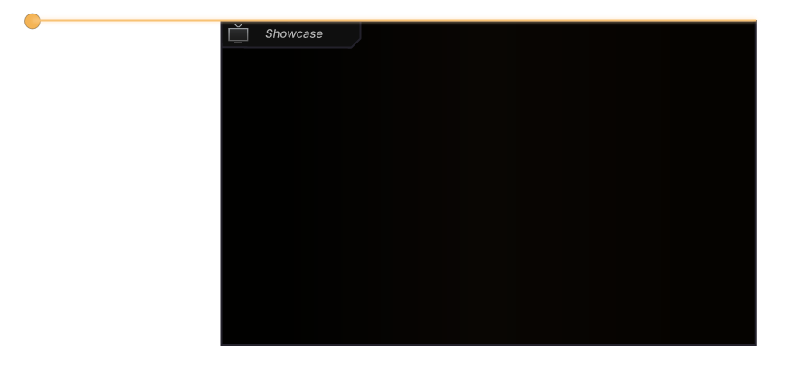
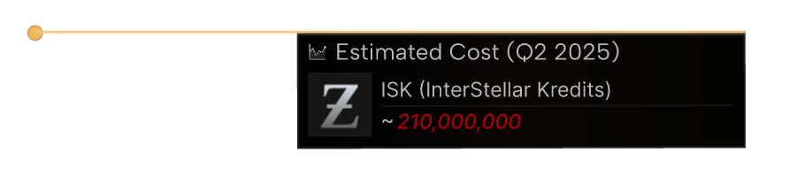

# Video Elements Library
This is an overview of our current video elements in use. All these animations can be tweaked for your specific purposes.

## Box with Label
[Go to element](box-with-label)

### Purpose
Will render a nice expanding box animation for a box that can be used to add separate graphics into. You would add the additional gfx in your video editor.

### Example

## Estimated Cost Box
[Go to element](estimated-cost-box)

### Purpose
Will render a nice expanding box animation for the estimated cost of an object in a video.

### Example

## Fitting Box
[Go to element](fitting-box)

### Purpose
Will render a nice expanding box animation with the fit of a ship.

### Example

## Pilot (Implants & Boosters) box
[Go to element](pilot-box)

### Purpose
Will render a nice expanding box animation with implants, boosters and their estimated cost.

### Example

## Typewriter Title
[Go to element](typewriter-title)

### Purpose
Will render a title and sub title being typed out.

### Example

