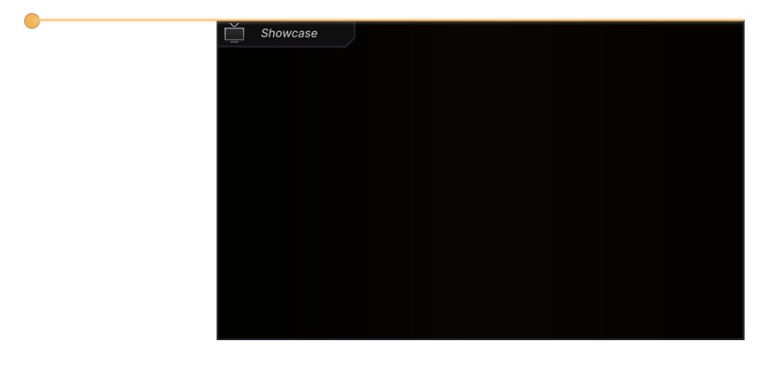

# Box with Label
The `box with label` will render a nice expanding box animation for a box that can be used to add separate graphics into. You would add the additional gfx in your video editor.

## Example 
_

## Example Animation
Note: Since it a GIF it as not as smooth as the import that will be in your video which will be 60 fps vs 30 fps of this give below. The speed of the animation is also slightly sped up due the converting from 60 to 30 fps.

## Adjustments
If you want to modify this component follow the instructions below.
1. Open up [Online Editor](https://editor.rive.app/) or [download](https://rive.app/downloads) the client 
2. Go to `Personal Files`
3. Drag the file `*.rev` to your workspace
4. Open up the new project
5. You can temporarily enable `Background (Hide Me)` or import a new background based on a image render of your video to get a feel for how the element will look in your scene. 
6. **Important** Always edit things on the `Design` tab to prevent ruining animations that are already setup for you.
7. Expand to tree on the left search for `Box Contents` → `{Cost}` to update the price of the box.
8. Expand to tree on the left search for `Box Contents` → Title → `{Date}` to update the last date the price was updated. This to give the user an indicated of how outdated the price could be.

## Fine tune content and animation based on your current video
1. Use your video editor software to create a render (image) of the moment you want to add the element.
2. Import this image into Rive by going to `Assets` → + and then add your file
3. Switch back to `Hierarchy`, right-click `Background (Hide Me)` and select `replace` then select your new image
4. You can now fine-tune the animation to match the scene composition

## Export
Once you made all the adjustments and want to add create the export of the animation to add to your video editor.

1. Be sure the `Background (Hide Me)` layer is hidden
2. Press the menu
3. Press `Open Render Queue`
4. In the new window select the tab `Queued`
5. And select the `+` icon
6. Switch mode to `Animation`
7. Format to `PNG Seq` and `60fps`
8. Press the ▶ button
9. Once this is done, go to the completed tab
10. Press ↓ button download the archive

## Import to video editor

1. Extract the archive in your video project folder, it will be a huge number of `png` images so extract them to their own folder.
2. In your video editor of choice add an `Image Sequence`

Each video editor is slightly different but generally you want these settings:
- `Use Original Size` to ensure the UX matches future elements you will also import to the video. 
- `Frame Rate` should be `60px`
