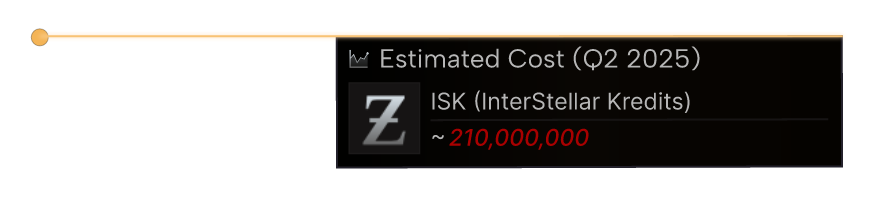

# Estimated Cost Box
The estimated cost box will render a nice expanding box animation for the estimated cost of an object in a video.

## Example 

## Example Animation
Note: Since it a GIF it as not as smooth as the import that will be in your video which will be 60 fps vs 24 fps of this give below. The speed of the animation is also slightly sped up due the converting from 60 to 24 fps.

## Adjustments
If you want to modify this component follow the instructions below.
1. Open up [Online Editor](https://editor.rive.app/) or [download](https://rive.app/downloads) the client 
2. Go to `Personal Files`
3. Drag the file `estimated_cost_box.rev` to your workspace
4. Open up the new project
5. You can temporarily enable `Background (Hide Me)` or import a new background based on a image render of your video to get a feel for how the element will look in your scene.
6. Expand to tree on the left search for `Box Contents` → `{Cost}` to update the price of the box.
7. Expand to tree on the left search for `Box Contents` → Title → `{Date}` to update the last date the price was updated. This to give the user an indicated of how outdated the price could be.

## Export
Once you made all the adjustments and want to add create the export of the animation to add to your video editor.

1. Press the menu
2. Press `Open Render Queue`
3. In the new window select the tab `Queued`
4. And select the `+` icon
5. Switch mode to `Animation`
6. Format to `PNG Seq` and `60fps`
7. Press the ▶ button
8. Once this is done, go to the completed tab
9. Press ↓ button download the archive

## Import to video editor

1. Extract the archive in your video project folder, it will be a huge number of `png` images so extract them to their own folder.
2. In your video editor of choice add an `Image Sequence`

Each video editor is slightly different but generally you want these settings:
- `Use Original Size` to ensure the UX matches future elements you will also import to the video. 
