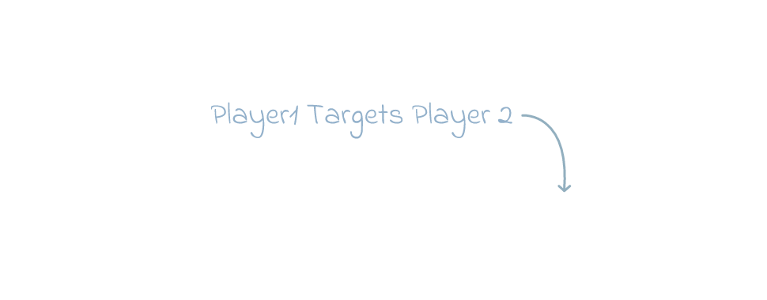

# Arrow & Text Component
The `arrow-and-text` component will render a nice question animation a hand-written piece of text and an arrow. To be used on the Horde Board.

## Example 

## Example Animation
Note: Since it a GIF it as not as smooth as the import that will be in your video which will be 60 fps vs 30 fps of this give below. The speed of the animation is also slightly sped up due the converting from 60 to 30 fps.

## Adjustments
If you want to modify this component follow the instructions below.
1. Open up [Online Editor](https://editor.rive.app/) or [download](https://rive.app/downloads) the client 
2. Go to `Personal Files`
3. Drag the file `*.rev` to your workspace
4. Open up the new project
5. Expand to tree on the left search for `Target` → `{Text}` adjust it to the text you want.
6. For adjusting the arrow to be a different length or orientation you go into `Target` → `Target Arrow` select each of the paths and adjust them.
7. If you make bigger changes to the text or arrow you will also need to adjust the `ClipArrow` and `ClipMask` animation elements these expand in the animation tab to make a portion of the drawing appear.
8. Start by making sure they are positioned correctly in design mode, generally small squares that are positioned in an orientation so it hits the entire arrow or text when expanded.
9. Then go to animation tab and go to the end keyframe for each clip and make sure that they are expanded all the way correctly.

## Export
Once you made all the adjustments and want to add create the export of the animation to add to your video editor.

1. Be sure the `Background (Hide Me)` layer is hidden
2. Press the menu
3. Press `Open Render Queue`
4. In the new window select the tab `Queued`
5. And select the `+` icon
6. Switch mode to `Animation`
7. Format to `PNG Seq` and `60fps`
8. Press the ▶ button
9. Once this is done, go to the completed tab
10. Press ↓ button download the archive

## Import to video editor

1. Extract the archive in your video project folder, it will be a huge number of `png` images so extract them to their own folder.
2. In your video editor of choice add an `Image Sequence`

Each video editor is slightly different but generally you want these settings:
- `Use Original Size` to ensure the UX matches future elements you will also import to the video. 
- `Frame Rate` should be `60px`
