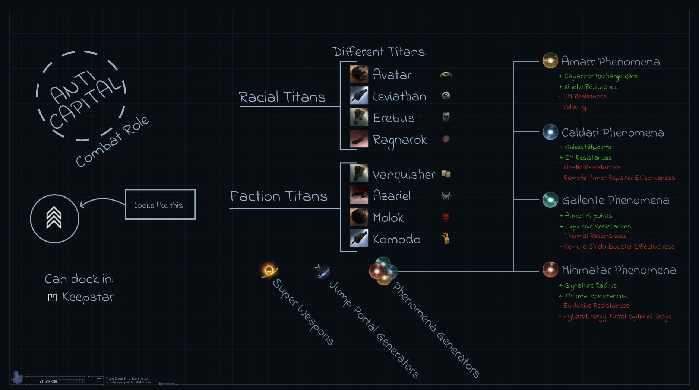

# Titan Class
The `Titan Class` is a huge file with lots of animations used for this explanation https://youtu.be/MWhe1Y_1-40?si=5vtvTEaCCm4qHrct&t=514.

It is not really meant as a file to edit and reuse, but certain elements could be imported to a future Horde Board explaining a different ship class or concept.

## Example 

## Adjustments
If you want to modify this component follow the instructions below.
1. Open up [Online Editor](https://editor.rive.app/) or [download](https://rive.app/downloads) the client 
2. Go to `Personal Files`
3. Drag the file `*.rev` to your workspace
4. Open up the new project
5. Expand to tree on the left search for `Handwritten Title` → `Title` → `{Text}` adjust it to the text you want.

## Export
Once you made all the adjustments and want to add create the export of the animation to add to your video editor.

1. Be sure the `Background (Hide Me)` layer is hidden
2. Press the menu
3. Press `Open Render Queue`
4. In the new window select the tab `Queued`
5. And select the `+` icon
6. Switch mode to `Animation`
7. Format to `PNG Seq` and `60fps`
8. Press the ▶ button
9. Once this is done, go to the completed tab
10. Press ↓ button download the archive

## Import to video editor

1. Extract the archive in your video project folder, it will be a huge number of `png` images so extract them to their own folder.
2. In your video editor of choice add an `Image Sequence`
3. In order to sync voice overs and visuals make use of hold frames or make cuts and import the image sequence as an image to have direct control of how long fragments are paused. 

Each video editor is slightly different but generally you want these settings:
- `Use Original Size` to ensure the UX matches future elements you will also import to the video. 
- `Frame Rate` should be `60px`
