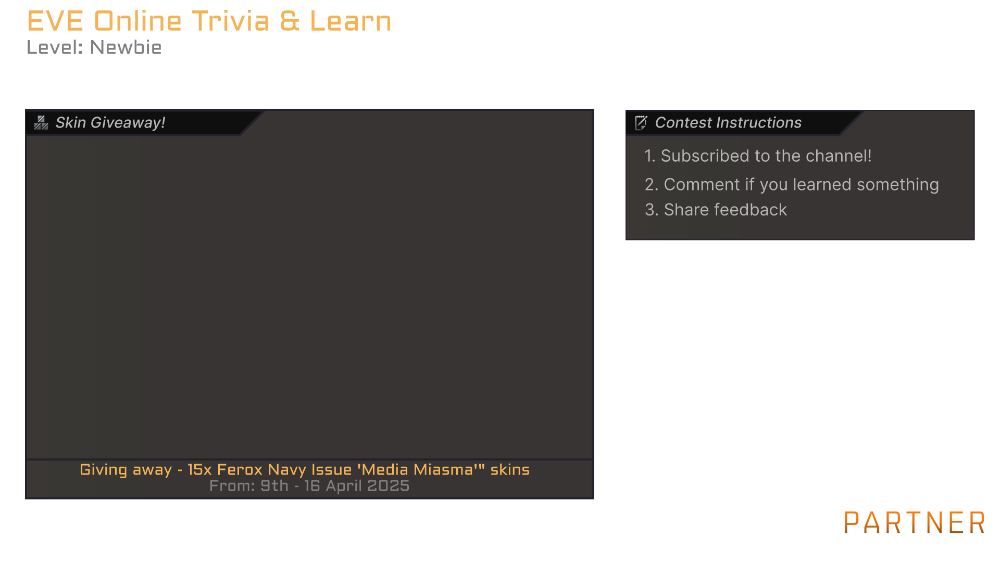

# Skin Contest
The `skin contest` component will render a scene featuring a skin give-away with instructions.

## Example 

## Example Animation
Note: Since it a GIF it as not as smooth as the import that will be in your video which will be 60 fps vs 30 fps of this give below. The speed of the animation is also slightly sped up due the converting from 60 to 30 fps.

## Adjustments
If you want to modify this component follow the instructions below.
1. Open up [Online Editor](https://editor.rive.app/) or [download](https://rive.app/downloads) the client 
2. Go to `Personal Files`
3. Drag the file `*.rev` to your workspace
4. Open up the new project
5. **Important** Always edit things on the `Design` tab to prevent ruining animations that are already setup for you.
6. Expand to tree on the left search for `Contest Title` → `{Text}` set the Title. 
7. Expand to tree on the left search for `Sub Title` → `{Text}` set the Sub Title. 
8. Expand to tree on the left search for `Instructions` → `{Line 1}`,`{Line 2}`,`{Line 3}` to set the instructions. You can also choose to hide this one if you want to provide the instructions at the end of the video. You will then need to export twice once with and once without. 
9. Expand to tree on the left search for `Instructions` → `{Title}` To set the title of the instructions box.
10. Expand to tree on the left search for `Give-Away` → `Instructions` → `Line 1` → `{TEXT}` To provide what we give away.
11. Expand to tree on the left search for `Give-Away` → `Instructions` → `Line 2` → `{TEXT}` To set the dates.
12. Expand to tree on the left search for `Give-Away` → `{Title}` To set the title of the skin preview box.

## Export
Once you made all the adjustments and want to add create the export of the animation to add to your video editor.

1. Be sure the `Background (Hide Me)` layer is hidden
2. Press the menu
3. Press `Open Render Queue`
4. In the new window select the tab `Queued`
5. And select the `+` icon
6. Switch mode to `Animation`
7. Format to `PNG Seq` and `60fps`
8. Press the ▶ button
9. Once this is done, go to the completed tab
10. Press ↓ button download the archive

## Import to video editor

1. Extract the archive in your video project folder, it will be a huge number of `png` images so extract them to their own folder.
2. In your video editor of choice add an `Image Sequence`

Each video editor is slightly different but generally you want these settings:
- `Use Original Size` to ensure the UX matches future elements you will also import to the video. 
- `Frame Rate` should be `60px`
