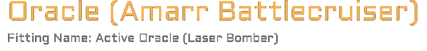

# Typewriter title
The `typewrite-title` will render a title and sub title being typed out.

## Example 

## Example Animation
Note: Since it a GIF it as not as smooth as the import that will be in your video which will be 60 fps vs 30 fps of this give below. The speed of the animation is also slightly sped up due the converting from 60 to 30 fps.

## Adjustments
If you want to modify this component follow the instructions below.
1. Open up [Online Editor](https://editor.rive.app/) or [download](https://rive.app/downloads) the client 
2. Go to `Personal Files`
3. Drag the file `*.rev` to your workspace
4. Open up the new project
5. You can temporarily enable `Background (Hide Me)` or import a new background based on a image render of your video to get a feel for how the element will look in your scene. 
6. **Important** Always edit things on the `Design` tab to prevent ruining animations that are already setup for you.
7. By default, you will see nothing, this is due to how the animation is setup. You can select `ROW 1 - ANIMATE ME` and expand the object to the right to see your text for adjustments. This is also the element we need to adjust the animation on later.
8. Expand to tree on the left search for `Row {X}` → `Title` → `{TEXT}` to update the text of each label.
9. When updating the text you will also need to adjust the animation so the aforementioned `ROW 1 - ANIMATE ME` clipping masks jumps at the right intervals, go to `Animate` tab. 
10. Per row of text you will see 2 animation properties `ROW 1 - ANIMATE ME` which controls how much of the text is visible and `ROW 1 - Cursor` which has a blinking animation setup so it looks like a cursor.
11. Go through each keyframe (every 5 ms) of `ROW 1 - ANIMATE ME` and make sure the box is expanded enough for each next letter to show, also include spaces in this animation!
12. After going through each frame adjust `ROW 1 - Cursor` so that it ends hidden and covers your entire animation.

## Fine tune content and animation based on your current video
1. Use your video editor software to create a render (image) of the moment you want to add the element.
2. Import this image into Rive by going to `Assets` → + and then add your file
3. Switch back to `Hierarchy`, right-click `Background (Hide Me)` and select `replace` then select your new image
4. You can now fine-tune the animation to match the scene composition

## Export
Once you made all the adjustments and want to add create the export of the animation to add to your video editor.

1. Be sure the `Background (Hide Me)` layer is hidden
2. Press the menu
3. Press `Open Render Queue`
4. In the new window select the tab `Queued`
5. And select the `+` icon
6. Switch mode to `Animation`
7. Format to `PNG Seq` and `60fps`
8. Press the ▶ button
9. Once this is done, go to the completed tab
10. Press ↓ button download the archive

## Import to video editor

1. Extract the archive in your video project folder, it will be a huge number of `png` images so extract them to their own folder.
2. In your video editor of choice add an `Image Sequence`

Each video editor is slightly different but generally you want these settings:
- `Use Original Size` to ensure the UX matches future elements you will also import to the video. 
- `Frame Rate` should be `60px`
